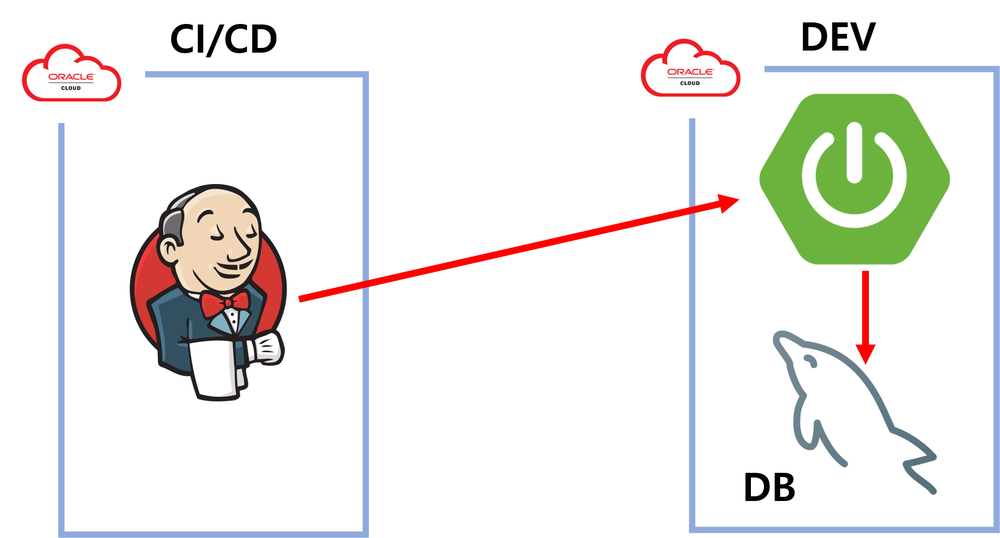

#  [Gigi](http://www.gigi.p-e.kr/)
> 퇴근 길 지하철 지연 현상에 대한 조사

---
 

# 1.  프로젝트 소개
* 판교에서 퇴근 시 분당선을 주로 이용하였는데 카카오 맵, 네이버 지도에서는 지하철의 지연 현상을 알 수 없었습니다. 이 것을 하나의 문제로 인식하여 퇴근 시간대 지하철의 혼잡도와 실제 도착 시간과의 연관성이 있다고 가정하고 분석하였습니다.

---
 

# 2.  팀원
* 오주담

---
 

# 3.  핵심 기능
* 퇴근 시간(17~19)에 혼잡도와 지하철 출구 역 이용자 수를 제공합니다.
    * 지오비전 퍼즐에서 제공하는 Open API를 활용하였습니다.
* 퇴근 시간 수인분당선의 실시간 도착 정보를 제공합니다..
    * 서울열린데이터에서 제공하는 Open API를 활용하였습니다.
  
---
 

# 4.  프로젝트 구조

---
 

# 5.  기술 스택
* Spring Boot
* Spring Batch
* MyBatis
* Jsp
* WebSocket
* MySql
* Jenkins
* Oracle Cluoud
  
---
 

# 6.  업데이트 내역
* 0.0.1
    * 개발 환경 구축
    * 지하철 혼잡도 관련 도메인 구현
    * 지하철 혼잡도 배치 시스템 구현
* 0.0.2
    * 로거 추가
    * 혼잡도를 시각화할 그래프 구현(Chart.js)
    * 지하철 명 클릭 시 그래프 출력
* 0.0.3
    * 지하철 실시간 도착, 위치 배치 기능 추가
* 0.0.4
    * 망포역에 한하여 실시간 도착 정보 출력
* 0.0.5
    * 배치 시스템 분리
    * 도착 예상 시간 출력

# 7. 사이트
* http://www.gigi.p-e.kr/
* https://github.com/OJUDAM/gigi-batch (배치 시스템)
